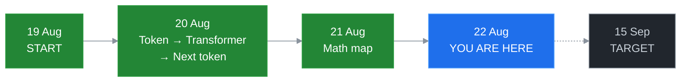
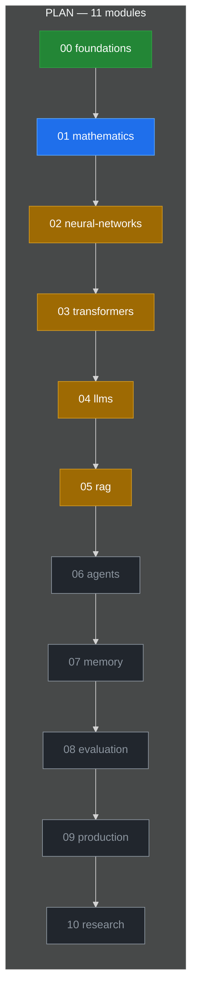
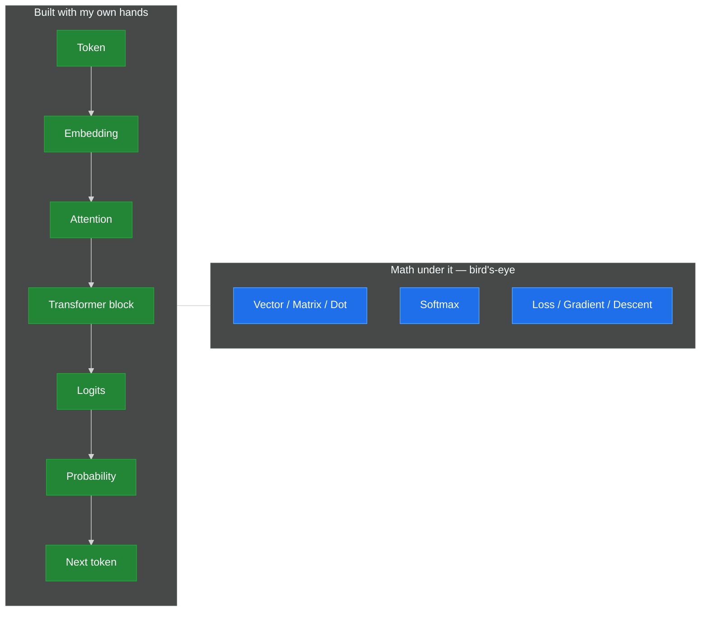

# AI Journey

> Snapshot **22 Aug 2026** · Calendar **4 / 28 days** · Target **15 Sep 2026**  
> You are here: **`01-mathematics`** (bird’s-eye done) → next: deepen math **or** continue the Transformer path  
> Goal: understand, build, evaluate, and deploy modern AI systems

```
START 19 Aug                         NOW                         TARGET 15 Sep
│████                                  │░░░░░░░░░░░░░░░░░░░░░░░░░░░░│
0%                                   14%                           100%
     foundations + math map
     neuron · token · attention · next-token
```





**Legend:** green = intro done · blue = **you are here** · amber = started (lab / intuition) · grey = not started



### Level now — 0 none · 1 heard it · 2 can explain · 3 technical

Self-score 20 Aug was **20/45**. After 20–21 Aug labs, placement looks like this (not a new quiz):

```
TOKEN              ████████░░  2/3   lab: bert tokenizer
EMBEDDING          ████████░░  2/3   lab: MiniLM + cosine
ATTENTION          ████████░░  2/3   lab: 2x2 self-attention  (was 0)
LLM NEXT-TOKEN     ████████░░  2/3   loop + temperature       (was 0)
TRAINING vs INFER  ████████░░  2/3   locked the split         (was 1)
VECTOR / DOT       ████████░░  2/3   bird's-eye + NumPy 32
SOFTMAX            ████████░░  2/3   7.2 vs 10.0 sharpening
LOSS / GD          ████████░░  2/3   toy descent to ~10
BACKPROP           ████░░░░░░  1/3   idea only, no full net
RAG                ████░░░░░░  1/3   why it works, no system
VECTOR DB          ██████████  3/3   from 20 Aug check
AGENTS             ████████░░  2/3   chatbot vs agent idea
MEMORY / CONTEXT   ████████░░  2/3   distinction
EVALUATION         ████░░░░░░  1/3
LATENCY / PROD     ░░░░░░░░░░  0/3
```

**Still weak (honest):** full backprop, why softmax uses `exp`, real learning rates, latency/production, a real RAG pipeline.

---

## [EN]

Start: 19 August 2026
Target: 15 September 2026

Goal:

Become capable of understanding, building,
evaluating and deploying modern AI systems.

This is no longer only a private study plan.
It is also a public AI engineering learning journey.

## Learning Philosophy

This repository documents my journey into AI engineering.

The goal is not to collect tutorials or reproduce code blindly.

For each concept, I try to understand:

1. What problem does it solve?
2. Why was it invented?
3. How does it work at a high level?
4. Can I build a minimal version?
5. Where is it used in real systems?
6. What are its limitations?
7. What comes next?

All experiments are documented so that another developer
can reproduce and follow the same learning path.

## Working rhythm

Upper bound: 3 hours a day.

- ~30% learning
- ~40% practice
- ~20% connection / research
- ~10% public documentation

If only 1 hour:

- 20 min explanation
- 25 min one mini experiment
- 10 min connections
- 5 min GitHub notes

By 15 September the repo should show history, experiments,
errors, mini implementations, and technical notes — not only "I learned AI".

Module folders (`00-foundations/` … `10-research/`) will later each have
their own `README.md`, `experiments/`, and `notes/`.

## [TUR]

Başlangıç: 19 Ağustos 2026
Hedef tarih: 15 Eylül 2026

Amaç:

Modern AI sistemlerini anlama, inşa etme,
değerlendirme ve yayınlama yetkinliği kazanmak.

Bu artık yalnızca özel bir öğrenme planı değil.
Aynı zamanda public bir AI engineering learning journey.

**Şu an:** 22 Ağu 2026 · takvim **4 / 28 gün** · **01-mathematics** kuşbakışı bitti.  
Yeşil = giriş tamam · mavi = buradasın · amber = lab/sezgi başladı · gri = henüz yok.

## Learning Philosophy

Bu repo AI engineering yolculuğumu belgeler.

Amaç tutorial biriktirmek veya kodu kör kopyalamak değil.

Her kavram için şunu anlamaya çalışırım:

1. Hangi problemi çözüyor?
2. Neden icat edildi?
3. Yüksek seviyede nasıl çalışıyor?
4. Minimal bir sürümünü kurabilir miyim?
5. Gerçek sistemlerde nerede kullanılır?
6. Sınırları neler?
7. Sırada ne var?

Tüm deneyler, başka bir geliştiricinin aynı yolu
yeniden üretebilmesi için belgelenir.

## Working rhythm

Üst sınır: günde 3 saat.

- ~30% öğrenme
- ~40% pratik
- ~20% bağlantı / araştırma
- ~10% public dokümantasyon

Yalnızca 1 saat varsa:

- 20 dk anlatım
- 25 dk tek mini uygulama
- 10 dk bağlantı
- 5 dk GitHub notu

15 Eylül'de repo tarih, deney, hata, mini implementasyon
ve teknik not göstermeli. Yalnızca "AI öğrendim" değil.

Modül klasörleri (`00-foundations/` … `10-research/`) ileride
her biri kendi `README.md`, `experiments/` ve `notes/` yapısına sahip olacak.
